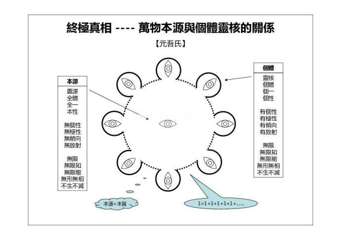
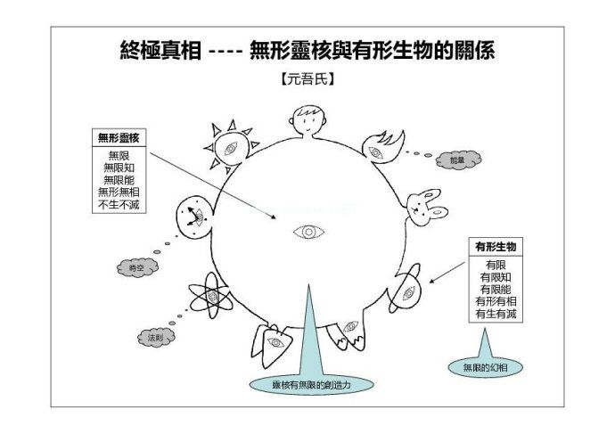

===============================
本源与个体的关系
===============================

元吾氏 ©  发布于：——  更新于：2022-02-09

-----

.. contents:: 目录
   :local:

-----

一图胜千言。

本源与个体的关系，无论如何用文字描述，也有词不达意的地方，也许图片能更好地说明。

以下两个示意图是对博文 “终极真相 —— 万物本源的描述” 的追加说明。

（注：以下为 “示意图”，非 “原型图”）。

1. 图一：万物本源与个体灵核的关系
============================================================

图一：万物本源与个体灵核的关系（本质与个体 —— 本源是个体的 “本质”）

2. 图二：无形灵核与有形生物的关系
============================================================

图二：无形灵核与有形生物的关系（无形与有形 —— 有形是无形的 “思想投影” 或 “思想编织品”）

3. 全部的真相
============================================================

全部的真相 = 真相 + 幻相 + 两者关系。

缺一不可。

--------------------------------------------------

（本人所述，皆为几十年亲身实践、亲身验证、亲身观察的客观记录。无理论假设、无逻辑推理、无照搬经典。个人经验，仅供参考。请勿拘泥字面，请勿绝对化，请勿迷信化。请勿相信我或任何经典，自己去尝试和发现。）

.. include:: ../../disclaimer.rst
